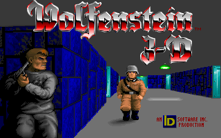
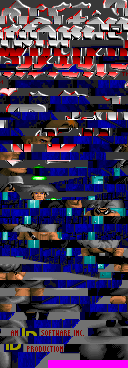

# unique-tiles
A command line tool that reads an image and writes another image with distinct tiles (squares of specified size) only.

Some of the sample images are from *Commander Keen: Secret of the Oracle* and *Wolfenstein 3D* by id Software.

Example (original on the left, output with default settings on the right):

## Command line arguments
*options* *inputFile* *outputFile*
* *options* are any number of these, separated by a space:
  * `--tilesize N`: The width and height of each tile, in pixels. `N` is 4 to 64. The default is 8.
  * `--tileorder V`: Order of tiles in the output image. `V` is one of these:
    * `o`: original (the first tile to occur in *inputFile* will occur first in *outputFile*; this is the default)
    * `p`: first by brightnesses of pixels, top left pixel first, then by original order
    * `a`: first by average brightness of each tile, then by original order
    * `c`: first by number of unique colors, then by original order
    * `cp`: first by number of unique colors, then by brightnesses of pixels, then by original order
    * `ca`: first by number of unique colors, then by average brightness of each tile, then by original order
* *inputFile*: Required. Image file to read (e.g. PNG). The width and height must be multiples of tile size. No alpha channel.
* *outputFile*: Required. PNG file to write. Will contain every distinct tile in the input file once. The width will be 16 times the tile size. The height will be a multiple of tile size.

Example: `python3 uniquetiles.py --tilesize 10 --tileorder p input.png output.png`
